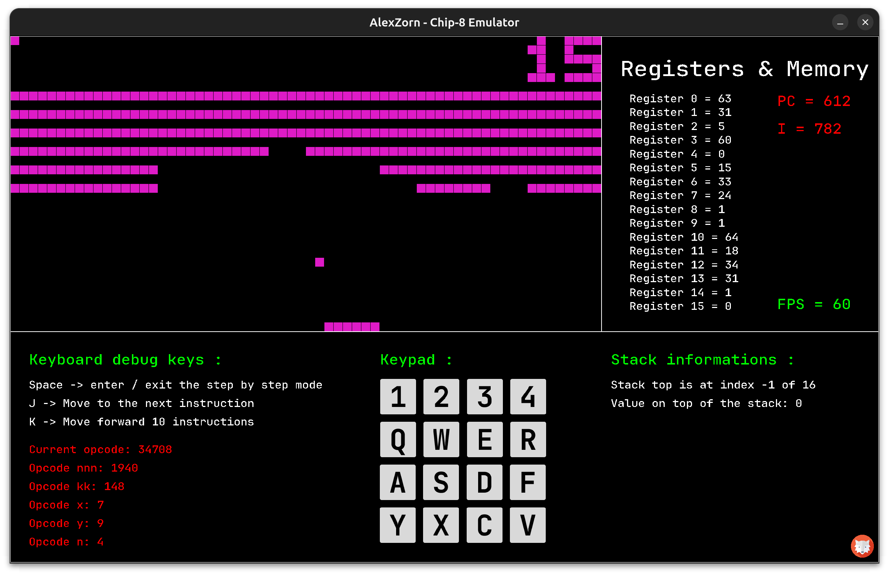
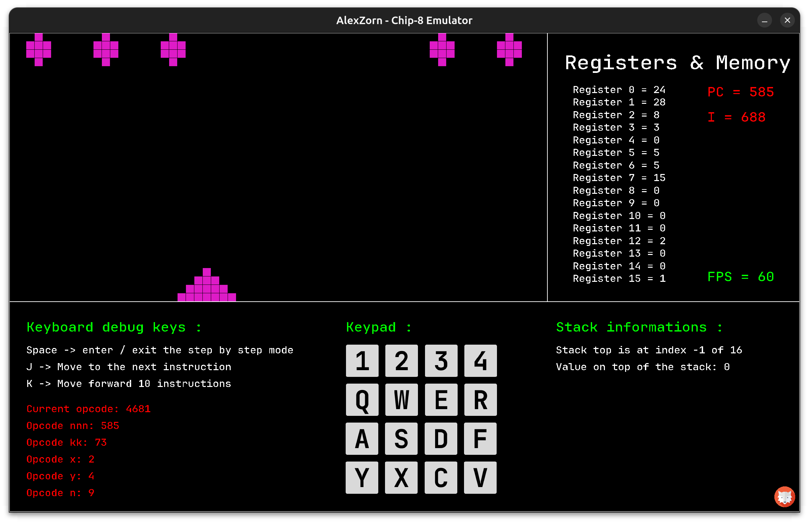
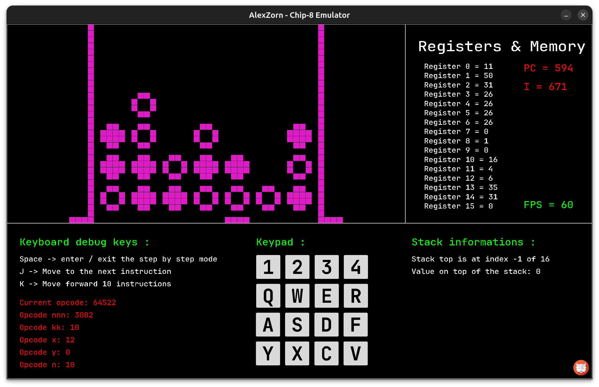

# My own Chip-8 Emulator 🖥

## The Project 💡
> - 🏫 - This Chip-8 Emulator is a school project for my third year of study in computer science in the EPTM which is a computer science school in Switzerland.
> - 💻 - The project is developed using the C programming language using SDL/2 as a graphics library.
> - 🗿 - Using neovim & a makefile as editor and build tool


## Particulars of sale
### Chip-8 Emulation 🦾
```txt
Hitting V1.0 the Chip-8 Emulator must be able to run a classical .ch8 program correctly
```

### Logs Display 📈
```txt
Hitting V1.0 the Chip-8 Emulator must be able to display logs, registers, memory states and content.
The objective is to show the user the processes happening inside of a computer.
```

## Showcase of the project
### Game of Breakout with the emulator


### Game of Breakout with the emulator


### Game of Breakout with the emulator


### Game of Breakout with the emulator


### Game of Breakout with the emulator


## Build 🏗️
```shell
# Build for debian based Linux

# just in case
sudo apt install git
sudo apt install gcc
sudo apt install make

sudo apt install libsdl2-dev
sudo apt install libsdl2-ttf-dev
git clone https://github.com/xZORNYx/chip8.git
cd chip8
make
./chip8 programs/Games/breakout.ch8
# Edit the path to boot on a different program
```

## Help and Sources 🪐
- The wikipedia [Chip-8](https://en.wikipedia.org/wiki/CHIP-8) page
- Cowgod's [Chip-8](http://devernay.free.fr/hacks/chip8/C8TECH10.HTM#6xkk) technical reference
